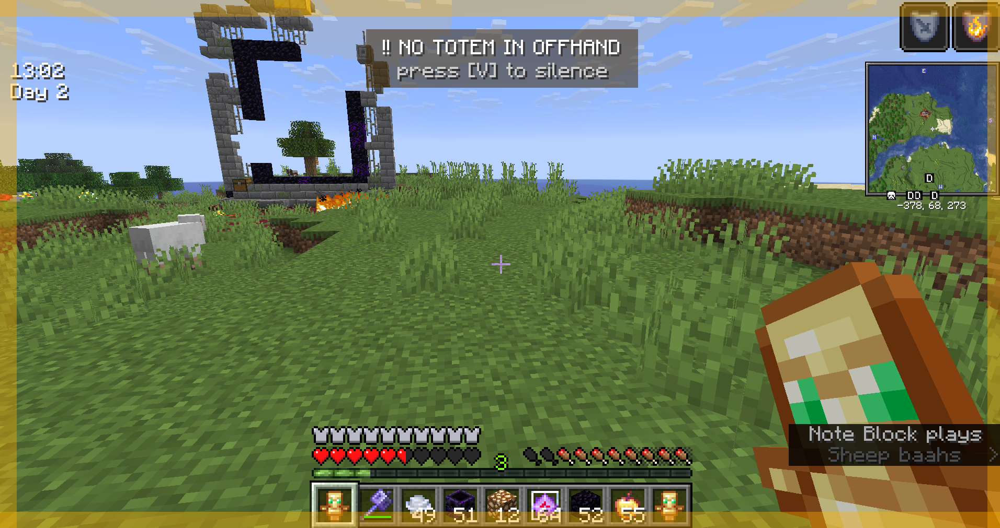
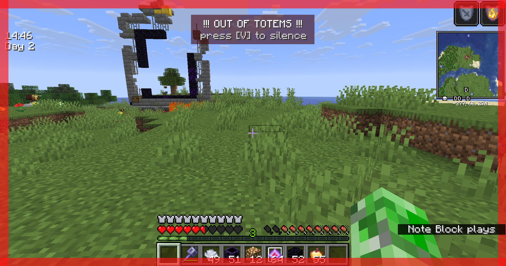

# Totem Warner

**Never forget your offhand totem again.**

A featherweight, fully client-side reminder that keeps an eye on your Totem of Undying and makes absolutely sure your offhand slot is never empty when it matters. No inventory automation, no server calls — just a warning loud enough to save your run.

Born from one very avoidable death: double-popped, refilled the main hand, forgot the offhand, and got sent home from a deathban server. This mod exists so that never happens to you.

## Features

- **Offhand reminder** — the moment you're holding a totem but *not* in your offhand, a pulsing amber border and banner remind you to move it over.
- **Out-of-totems alert** — down to zero totems anywhere? The warning turns red, faster, and louder so you know it's time to disengage.
- **Impossible to ignore** — a screen-edge pulse plus a repeating alert tone is tuned to catch your eye even when you're locked into a fight or distracted.
- **One-key silence** — tap a key (default **V**) to mute the current warning and keep playing through a clutch moment. It re-arms itself automatically when your situation changes, so you're never left unwarned.
- **Smart activation** — stays completely silent until you pick up your first totem of the session, so it never nags you when totems aren't in play.
- **100% client-side** — it only reads your own inventory and draws to your screen. It never moves items and never sends anything to the server, so it works like a resource pack from the server's point of view. Safe on deathban and no-auto-totem servers *(always check the individual server's rules first)*.

## How it works

Once you've held your first totem, Totem Warner watches two things: whether a totem is in your offhand, and whether you have any left at all. Miss the offhand and you get an amber nudge; run out entirely and you get a red, urgent alert. Slot a totem back into your offhand and everything goes quiet again.

## Requirements

- Fabric Loader
- Fabric API
- Minecraft **1.21.11**/**26.1.2**